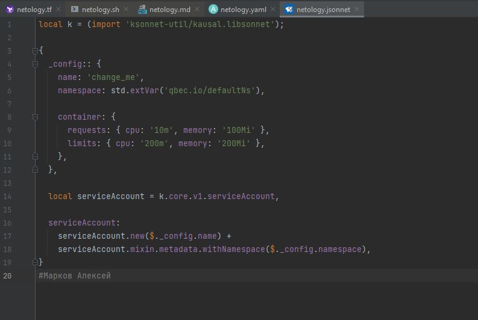
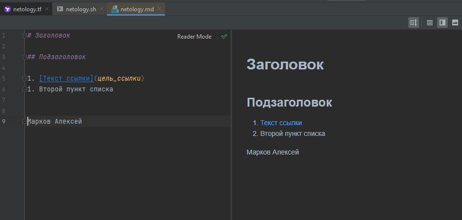
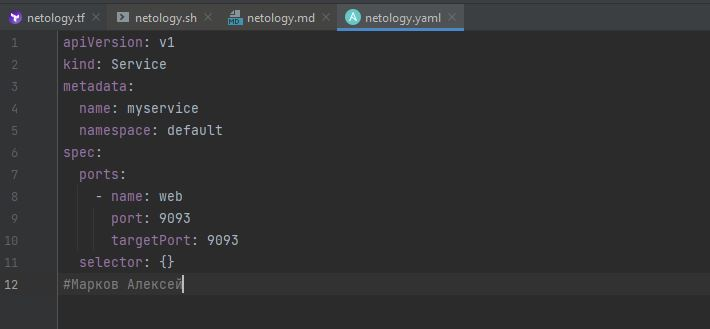
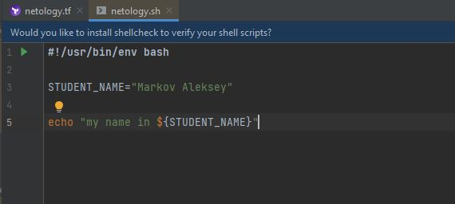
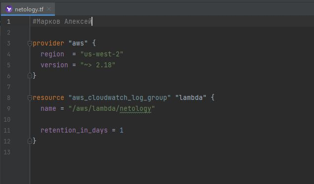

## 1.1. Введение в DevOps

Задание №1 - Подготовка рабочей среды
 - 
 - 
 - 
 - 
 - 

Задание №2 - Описание жизненного цикла задачи (разработки нового функционала)

0- Менеджер проекта аккумулирует все запросы на доработку.

1- Собранные задачи выносятся на обсуждение. Производится планирование на будущую неделю.

2- Изменения/доработки кода ежедневно интегрируются в тестовую ветку кода. 

3- После после прохождения автоматических тестов код помечается как готовый к развертыванию в тестовую среду. Тестовая среда представляет из себя полную копию продуктивного сайта. В случае наличия ошибок - генерируется уведомление и код отправляется на доработку.

4- После деплоя в тестовуюю среду тестировщик проводит тест кейсы (функциональное тестирование, интеграционной, и тд). В случае наличия ошибок код отправляется на доработку. 

5- Если ошибок не выявлено релиз отправляется на согласование менеджеру провекта.

6- Деплой в продуктив.

