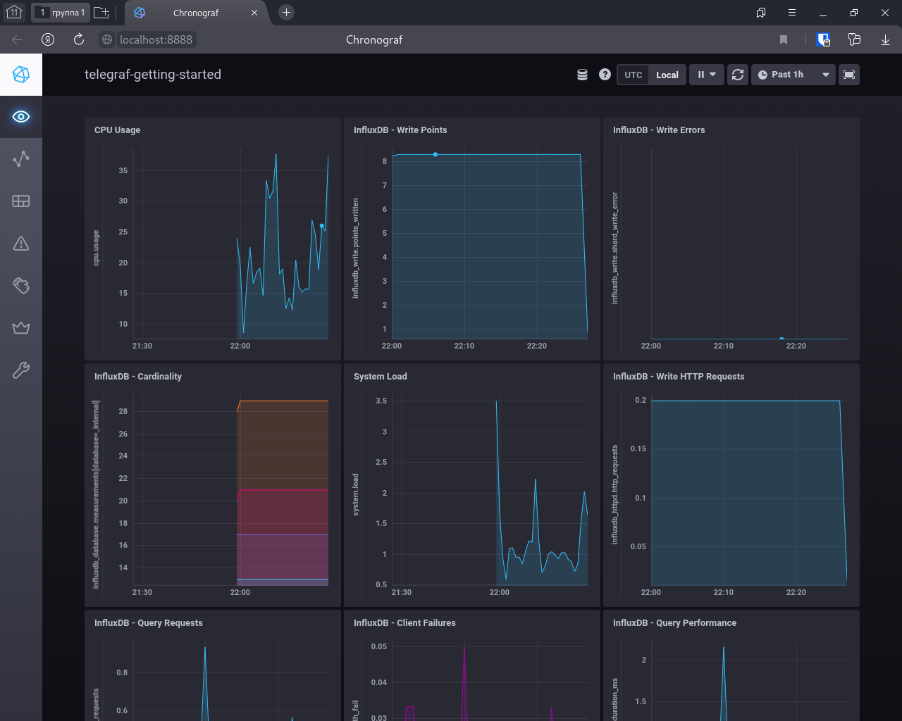
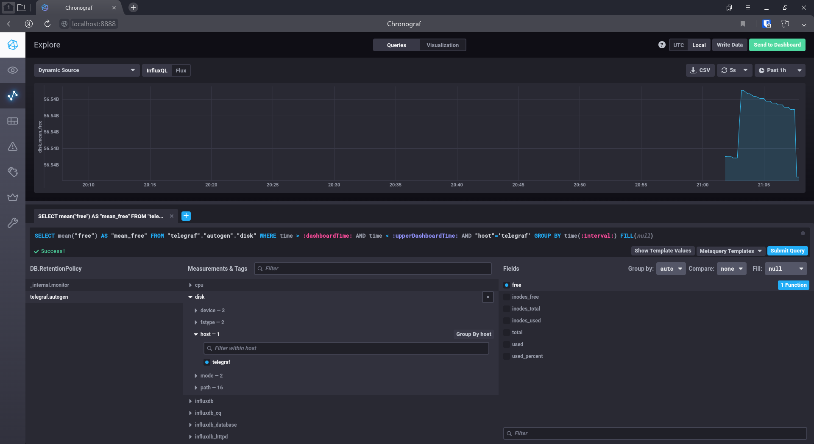
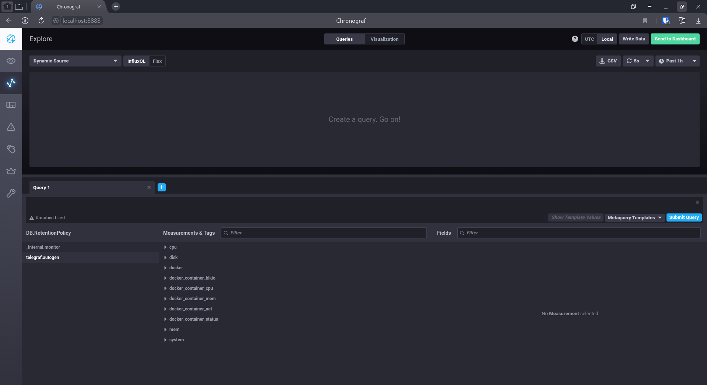
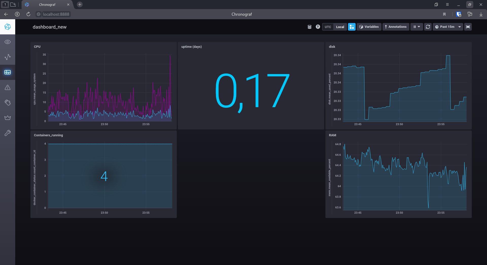

# Домашнее задание к занятию "10.02. Системы мониторинга"

## Обязательные задания

1. Опишите основные плюсы и минусы pull и push систем мониторинга.

Push
Плюсы: 
* В простейшем случае отдельного сервера управления может и не быть. Агенты могут самостоятельно писать значения в базу. 
* Возможность настройки репликации на уровне агента
* Правила отправки данных можно настроить индивидуально для конкретного агента 
* На сетевом уровне генерируется меньше трафика, отправка днных происходит быстрее (использование UDP)
Минусы:
* Конфигурация должна настраиваться на каждом агенте отдельно
* Некорректно сконфигурированный агент может генерировать большое колиество трафика и запросов на сервер


Pull
Плюсы: 
* Единая точка конфигурации (что и откуда забирать настраивается на сервере)
* Сервер мониторинга более эффективно утилизирует аппаратные ресурсы 
* Легче диагнтстировать агент (HTTP запрос можно отправить через браузер или curl)
* Гарантированая доставка данных (использование TCP)
Минусы:
* В случае проблем с сервером может произойти потеря данных
* Отсутсвует возможность настройки репликации на уровне агента


2. Какие из ниже перечисленных систем относятся к push модели, а какие к pull? А может есть гибридные?

* Prometheus - pull 
* TICK - push
* Zabbix - гибридная
* VictoriaMetrics - гибридная
* Nagios - pull

3. Склонируйте себе репозиторий и запустите TICK-стэк, используя технологии docker и docker-compose.

- curl http://localhost:8086/ping
```bash
[admin@kingdom sandbox]$ curl http://localhost:8086/ping -v
*   Trying 127.0.0.1:8086...
* Connected to localhost (127.0.0.1) port 8086 (#0)
> GET /ping HTTP/1.1
> Host: localhost:8086
> User-Agent: curl/7.82.0
> Accept: */*
> 
* Mark bundle as not supporting multiuse
< HTTP/1.1 204 No Content
< Content-Type: application/json
< Request-Id: f5412c88-1c05-11ed-81d2-0242ac120003
< X-Influxdb-Build: OSS
< X-Influxdb-Version: 1.8.10
< X-Request-Id: f5412c88-1c05-11ed-81d2-0242ac120003
< Date: Sun, 14 Aug 2022 19:19:03 GMT
< 
* Connection #0 to host localhost left intact

```
- curl http://localhost:8888

```bash
[admin@kingdom sandbox]$ curl http://localhost:8888 -v
*   Trying 127.0.0.1:8888...
* Connected to localhost (127.0.0.1) port 8888 (#0)
> GET / HTTP/1.1
> Host: localhost:8888
> User-Agent: curl/7.82.0
> Accept: */*
> 
* Mark bundle as not supporting multiuse
< HTTP/1.1 200 OK
< Accept-Ranges: bytes
< Cache-Control: public, max-age=3600
< Content-Length: 336
< Content-Security-Policy: script-src 'self'; object-src 'self'
< Content-Type: text/html; charset=utf-8
< Etag: "3362220244"
< Last-Modified: Tue, 22 Mar 2022 20:02:44 GMT
< Vary: Accept-Encoding
< X-Chronograf-Version: 1.9.4
< X-Content-Type-Options: nosniff
< X-Frame-Options: SAMEORIGIN
< X-Xss-Protection: 1; mode=block
< Date: Sun, 14 Aug 2022 19:20:18 GMT
< 
* Connection #0 to host localhost left intact
<!DOCTYPE html><html><head><meta http-equiv="Content-type" content="text/html; charset=utf-8"><title>Chronograf</title><link rel="icon shortcut" href="/favicon.fa749080.ico"><link rel="stylesheet" href="/src.9cea3e4e.css"></head><body> <div id="react-root" data-basepath=""></div> <script src="/src.a969287c.js"></script> </body></html>
```

- curl http://localhost:9092/kapacitor/v1/ping

```bash
[admin@kingdom sandbox]$ curl http://localhost:9092/kapacitor/v1/ping -v
*   Trying 127.0.0.1:9092...
* Connected to localhost (127.0.0.1) port 9092 (#0)
> GET /kapacitor/v1/ping HTTP/1.1
> Host: localhost:9092
> User-Agent: curl/7.82.0
> Accept: */*
> 
* Mark bundle as not supporting multiuse
< HTTP/1.1 204 No Content
< Content-Type: application/json; charset=utf-8
< Request-Id: 335ba47e-1c06-11ed-8192-000000000000
< X-Kapacitor-Version: 1.6.4
< Date: Sun, 14 Aug 2022 19:20:47 GMT
< 
* Connection #0 to host localhost left intact

```

- скриншот веб-интерфейса ПО chronograf 



4. Перейдите в веб-интерфейс Chronograf (http://localhost:8888) и откройте вкладку Data explorer. Приведите скриншот с отображением метрик утилизации места на диске (disk->host->telegraf_container_id) из веб-интерфейса.



5. Изучите список telegraf inputs. Добавьте в конфигурацию telegraf следующий плагин - docker.



## Дополнительное задание

В веб-интерфейсе откройте вкладку Dashboards. Попробуйте создать свой dashboard 

