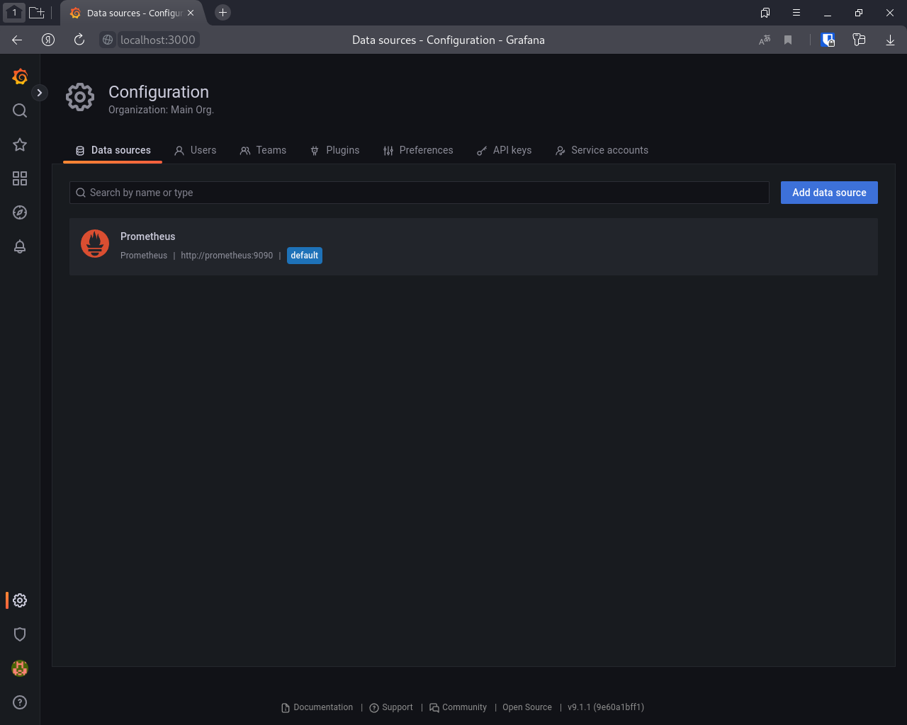
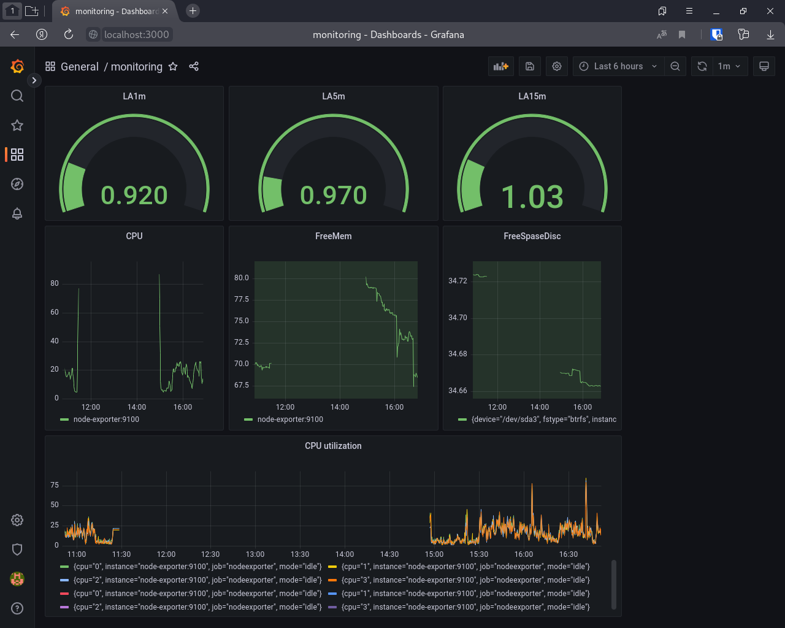
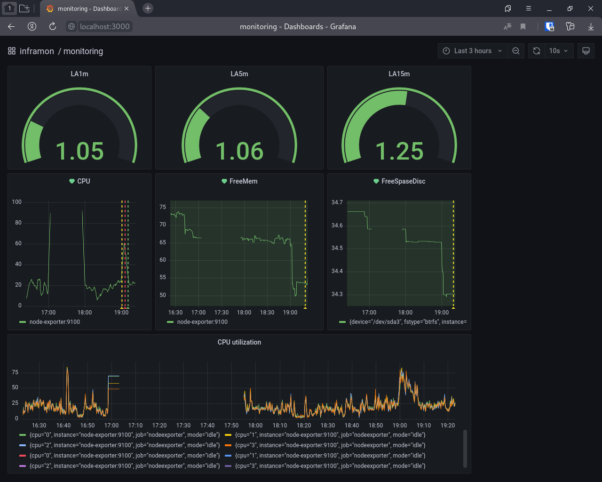

# Домашнее задание к занятию "10.03. Grafana"

## Задание 1

Для решения задания использовался собственный [docker-манифест](docker-compose.yml). Prometheus в Grafana подключается автоматически, параметры подключения указаны в  [datasource.yaml](./src/grafana/provisioning/datasources/datasource.yaml).



## Задание 2

```bash
#Загрузка CPU в %
 100 * (1- avg by(instance) (irate(node_cpu_seconds_total{mode="idle"}[5m])))

#CPULA 1/5/15
node_load1
node_load5
node_load15

# Свободная память в %
(node_memory_MemAvailable_bytes / on(instance) node_memory_MemTotal_bytes ) * 100

# Свободная место на дистке в %
(node_filesystem_avail_bytes{mountpoint="/"} / node_filesystem_size_bytes ) * 100
```



## Задание 3




## Задание 4

[dashboard.json](./src/grafana/provisioning/dashboards/dashboard.json)
