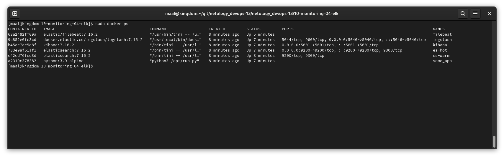
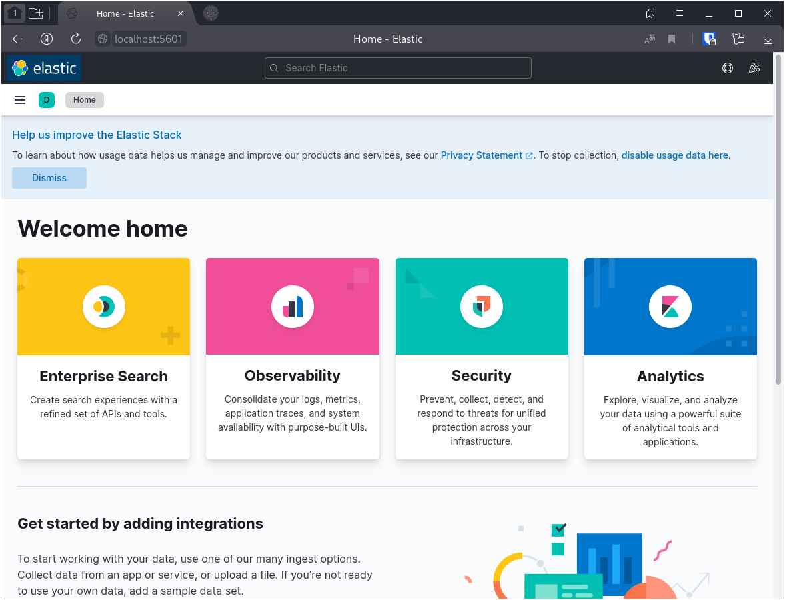
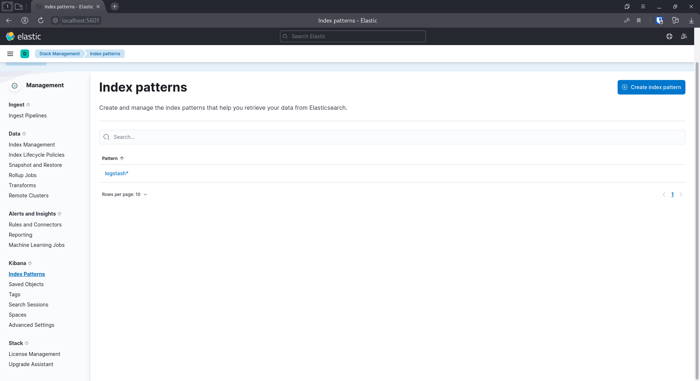
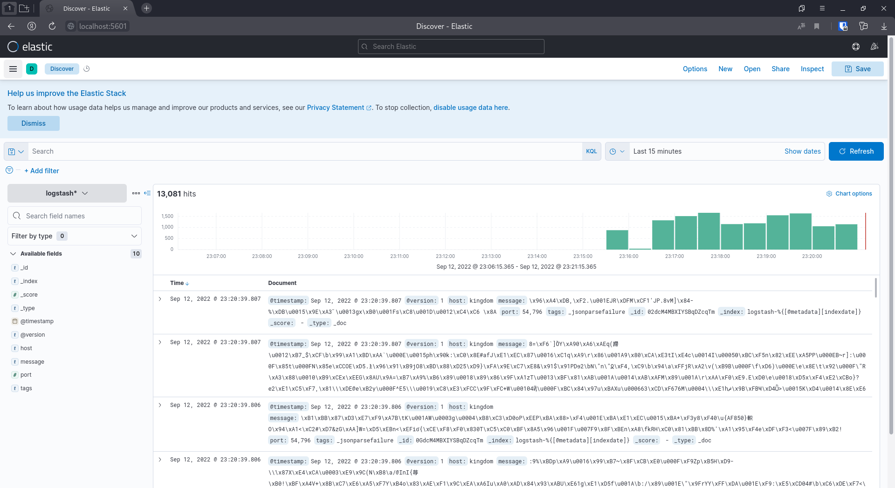

# Домашнее задание к занятию "10.04. ELK"

## Задание 1

Cкриншот docker ps через 5 минут после старта всех контейнеров (их должно быть 5)

скриншот интерфейса kibana

Для запуска использовался docker-compose манифест из директории help, но были внесены небольшие исправления (изменена версия образов, в конфиге logstash исправлена опечатка, имена контейнеров заменены на IP)

## Задание 2

Перейдите в меню создания index-patterns в kibana и создайте несколько index-patterns из имеющихся.

Перейдите в меню просмотра логов в kibana (Discover).

