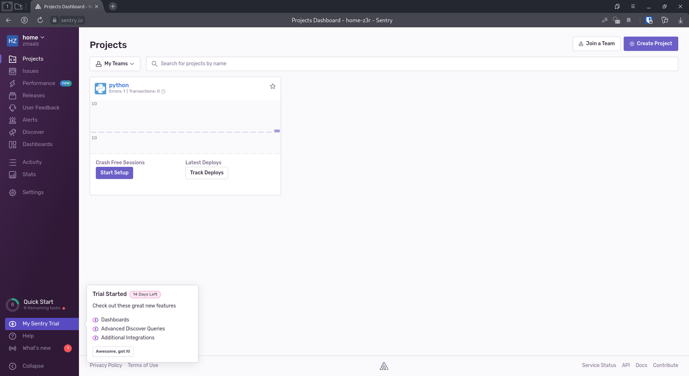
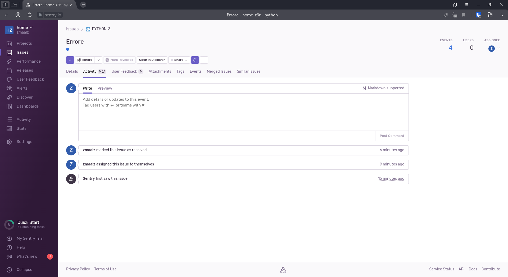
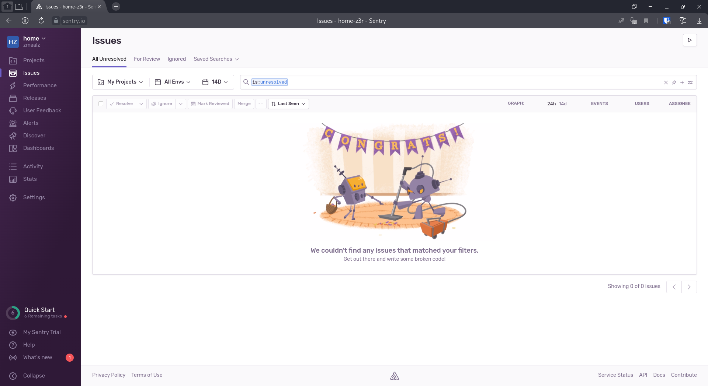
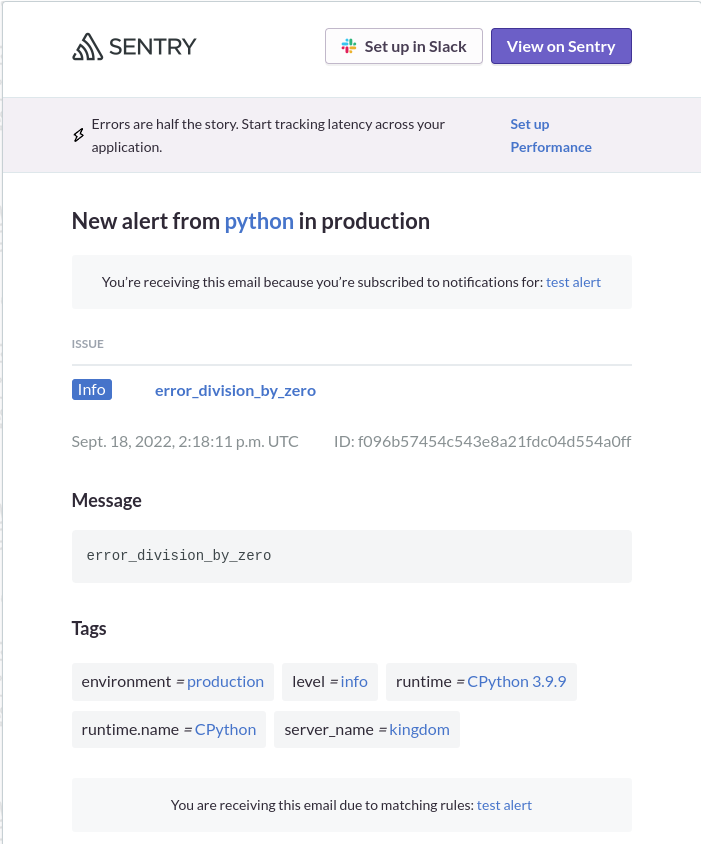
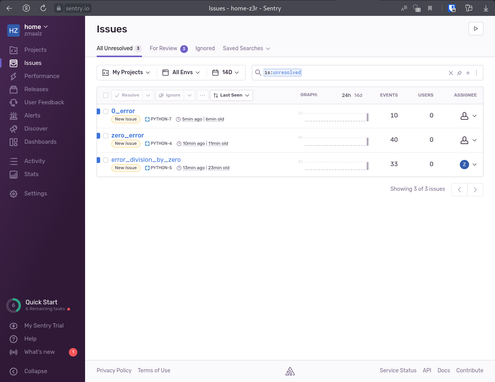

# Домашнее задание к занятию "10.05. Sentry"

## Задание 1

Cкриншот меню Projects


## Задание 2

Cкриншот Stack trace из закрытого события и список событий проекта, после нажатия Resolved



## Задание 3

Скриншот тела сообщения из оповещения на почте.



## Задание повышенной сложности

```python
#!/usr/bin/env python3
import sentry_sdk
sentry_sdk.init(
    dsn="https://6b9c062346234357a56928ca3bd2984f.ingest.sentry.io/6755298",
    traces_sample_rate=1.0
)

n = 0
a = [5,'en',3,4,]

while n < 5:
    try:
        for i in a:
            division_by_zero = 1 / int(i)
    except:
        sentry_sdk .capture_message("0_error")
        print(f'Ошибка деления на {i}')  
    n += 1
    print(n) 

```

