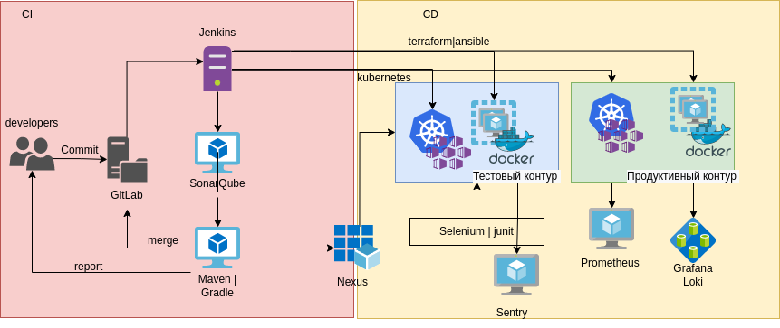

# Домашнее задание к занятию "11.03 Микросервисы: подходы"

Схематичное изображение предлагаемой инфраструктуры.

## Задача 1: Обеспечить разработку

Предложите решение для обеспечения процесса разработки: хранение исходного кода, непрерывная интеграция и непрерывная поставка. Решение может состоять из одного или нескольких программных продуктов и должно описывать способы и принципы их взаимодействия.

Решение должно соответствовать следующим требованиям:

* Облачная система;
* Система контроля версий Git;
* Репозиторий на каждый сервис;
* Запуск сборки по событию из системы контроля версий;
* Запуск сборки по кнопке с указанием параметров;
* Возможность привязать настройки к каждой сборке;
* Возможность создания шаблонов для различных конфигураций сборок;
* Возможность безопасного хранения секретных данных: пароли, ключи доступа;
* Несколько конфигураций для сборки из одного репозитория;
* Кастомные шаги при сборке;
* Собственные докер образы для сборки проектов;
* Возможность развернуть агентов сборки на собственных серверах;
* Возможность параллельного запуска нескольких сборок;
* Возможность параллельного запуска тестов;

Обоснуйте свой выбор.

Для организации инфраструктуры и обеспечения процессов CI/CD предлагается использовать следующие системы:
* SCM - Gitlab
* Оркестрация - Jenkins
* Линтеры - SonarQube
* Сборка - Maven|Gradle
* Хранение артефактов - Nexus
* Подготовка тестовой инфраструктуры - Terraform, ansible | kubernetis 
* Тестирование - Selenium, junit
* Мониторинг приложения - Sentry 

Gitlab имеет простой и понятный интерфейс, web ide, встроенную wiki, для удобства масштабирования для оркестрации и хранения артефактов используются внешние системы. В качестве системы оркестрации предлагается использвоать - Jenkins, программное обеспеение с открытым исходным кодом и активным сообществом. Для управления микросервисами используется Kubernetis, а для управления системами не требующиеми постоянного развертывания ( системы мониторинга, балансировщики, LDAP и т.д.) используется ansible. Для приведения кода к единому стилю и автоматизации процесса отлова опечаток и проблем с синтаксисом/логикой - SonarQube. В web проекках для упрощения отладки можно добавить Sentry.  

## Задача 2: Логи

Предложите решение для обеспечения сбора и анализа логов сервисов в микросервисной архитектуре. Решение может состоять из одного или нескольких программных продуктов и должно описывать способы и принципы их взаимодействия.

Решение должно соответствовать следующим требованиям:

Сбор логов в центральное хранилище со всех хостов обслуживающих систему;
Минимальные требования к приложениям, сбор логов из stdout;
Гарантированная доставка логов до центрального хранилища;
Обеспечение поиска и фильтрации по записям логов;
Обеспечение пользовательского интерфейса с возможностью предоставления доступа разработчикам для поиска по записям логов;
Возможность дать ссылку на сохраненный поиск по записям логов;
Обоснуйте свой выбор.

Система сбора логов - Grafana Loki. 

Loki более эффективно расходует оперативную память (благодря индексации только метаданных), язык запросов LogQL схож с PromQL Prometheus. Для визуализация данных используется Grafana, она имеет достаточно функциональную систему алертинга. Также единая платформа визуализации позволит создавать общие дашборды c Prometheus для отслеживания состояния систем. 

## Задача 3: Мониторинг

Предложите решение для обеспечения сбора и анализа состояния хостов и сервисов в микросервисной архитектуре. Решение может состоять из одного или нескольких программных продуктов и должно описывать способы и принципы их взаимодействия.

Решение должно соответствовать следующим требованиям:

Сбор метрик со всех хостов, обслуживающих систему;
Сбор метрик состояния ресурсов хостов: CPU, RAM, HDD, Network;
Сбор метрик потребляемых ресурсов для каждого сервиса: CPU, RAM, HDD, Network;
Сбор метрик, специфичных для каждого сервиса;
Пользовательский интерфейс с возможностью делать запросы и агрегировать информацию;
Пользовательский интерфейс с возможность настраивать различные панели для отслеживания состояния системы;
Обоснуйте свой выбор.

Система мониторинга - Prometheus + Grafana.

Prometheus использует pull модель, что позволяет более эффективно утилизирует ресурсы сервера, гарантированая доставка данных (используется tcp), единая точка конфигурации (что и откуда забирать настраивается на сервере).
