# Дипломный проект профессии DevOps-инженер

[Задание](https://github.com/netology-code/devops-diplom-yandexcloud)

## Облачная инфраструктура 

**Первоначальная настрока облака**

В default каталоге создается:
- Бакет для хранения конгфигурации terraform;
- KMS сервер и ключ для шифрования Бакета;
- Сервисный аккаунт с правами на создание ресурсов в облаке.


**Архитектура**

Сеть:
- DMZ зона
- Серверная подсеть
- Шлюз/Nat
- Балансировщик нагрузки

Серверы:
- kubemaster_instance (K8s control plane) - 1 ВМ
- kubenodes-group (K8s worker nodes) - 2 ВМ
- kubeingress-group (K8s ingress nodes) - 1 ВМ
- gitlab_instance (Gitlab CI) - 1 ВМ
- ceph_instance (Ceph кластер и Gitlab runner) - 1 ВМ

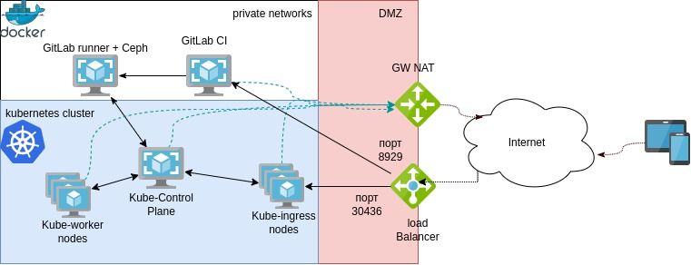

Для упрощения архитектуры и снижения затрат на аренду облачных ресурсов в stage K8s, кластер ceph были развернуты не в кластерном режиме.

[terraform-repo.git](https://github.com/zMaAlz/terraform-repo) - репозиторий с terraform манифестами для создания инфраструктуры в YC 

Добавляем токен и id облака в переменные окружения, инициируем terraform и запускаем подготовку инфраструктуры.

```bash
export TF_VAR_YC_FOLDER_ID=$(yc config get folder-id) && \
export TF_VAR_YC_CLOUD_ID=$(yc config get cloud-id) && \
export TF_VAR_YC_TOKEN=$(yc iam create-token)

 terraform init \
    -backend-config="access_key=YC...ZvR" \
    -backend-config="secret_key=YC...h2" 

Initializing the backend...

Initializing provider plugins...
- Reusing previous version of yandex-cloud/yandex from the dependency lock file
- Using previously-installed yandex-cloud/yandex v0.91.0

Terraform has been successfully initialized!

[maal@kingdom terraform-repo]$ terraform plan

Terraform used the selected providers to generate the following execution plan. Resource actions are indicated with the following symbols:
  + create
...

Changes to Outputs:
  + external_ip_address                       = (known after apply)
  + instance_ip_addr_ceph_instance            = "192.168.2.200"
  + instance_ip_addr_gitlab_instance          = "192.168.2.210"
  + instance_ip_addr_kubeingress-instance     = (known after apply)
  + instance_ip_addr_kubemaster_instance      = "192.168.2.220"
  + instance_ip_addr_kubenode1_instance       = "192.168.2.221"
  + instance_ip_addr_kubenode2_instance       = "192.168.2.222"
  + instance_ip_addr_nat-instance             = "10.2.2.254"
  + instance_nat_ip_addr_nat-instance         = (known after apply)
  + service_account                           = (known after apply)
  + yandex_resourcemanager_folder_WORK_FOLDER = (known after apply)

[maal@kingdom terraform-repo]$ terraform apply

Terraform used the selected providers to generate the following execution plan. Resource actions are indicated with the following symbols:
  + create
...
yandex_compute_instance_group.kubeingress-group-lb: Creation complete after 2m43s [id=cl1go4td0be58aomnksc]
yandex_lb_network_load_balancer.kube-lb: Creating...
yandex_lb_network_load_balancer.kube-lb: Creation complete after 2s [id=enpvfuubbca8l3dtd6jp]

Apply complete! Resources: 29 added, 0 changed, 0 destroyed.

Outputs:

external_ip_address = "51.250.95.129"
instance_ip_addr_ceph_instance = "192.168.2.200"
instance_ip_addr_gitlab_instance = "192.168.2.210"
instance_ip_addr_kubeingress-instance = ""
instance_ip_addr_kubemaster_instance = "192.168.2.220"
instance_ip_addr_kubenode1_instance = "192.168.2.221"
instance_ip_addr_kubenode2_instance = "192.168.2.222"
instance_ip_addr_nat-instance = "10.2.2.254"
instance_nat_ip_addr_nat-instance = "158.160.104.104"
service_account = "ajeh78he9584bh1oj17p created"
yandex_resourcemanager_folder_WORK_FOLDER = "b1gso53savovgi3bu3jf"

```

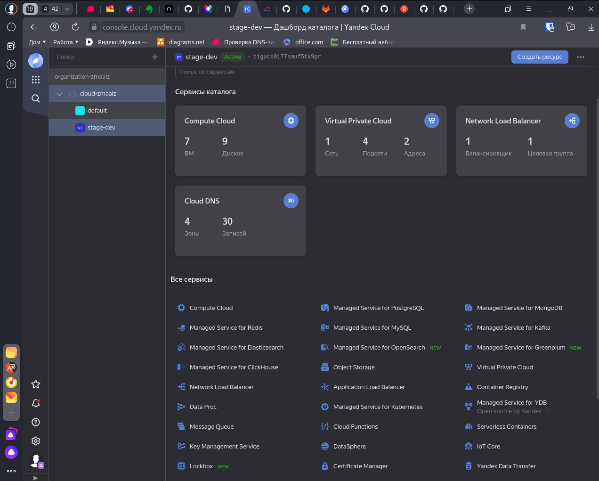

|:----------------------:|:-----------------------:|:----------------------------:|:----------------------------:|
|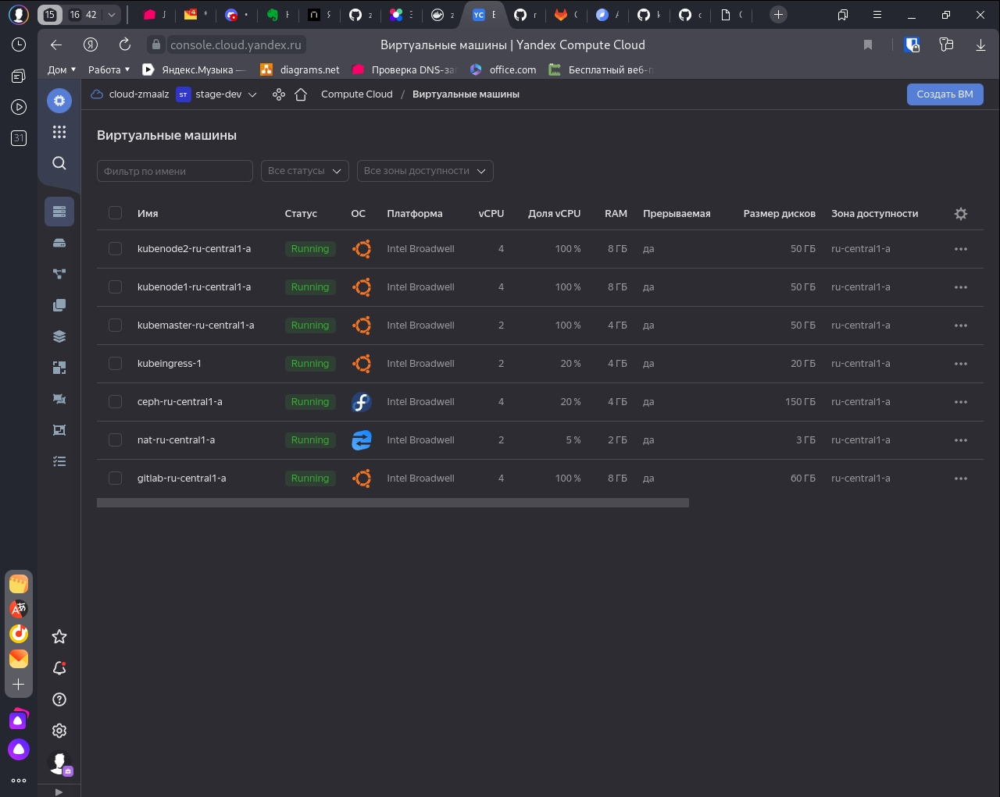|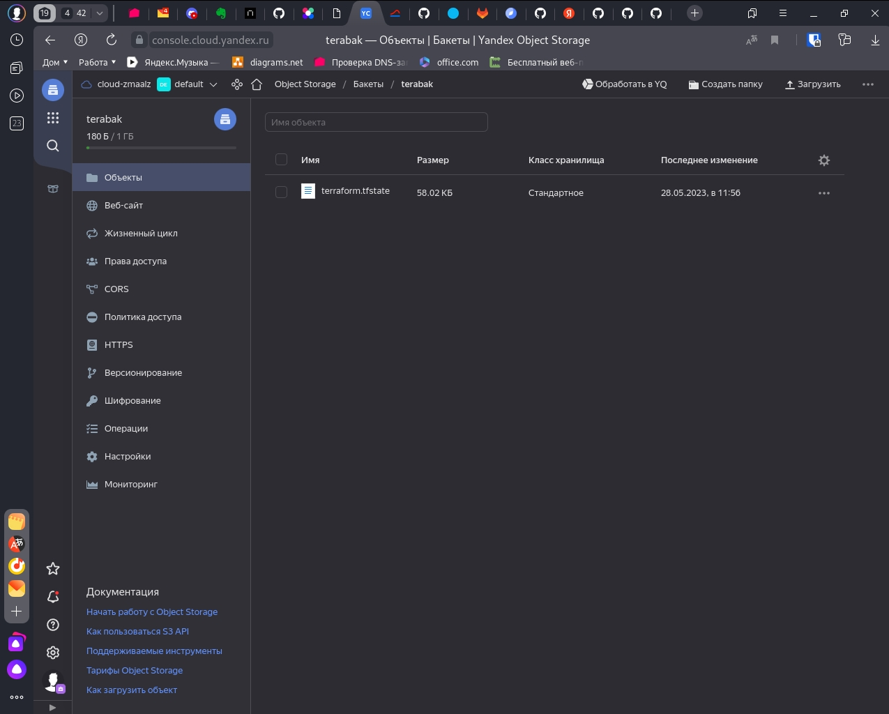|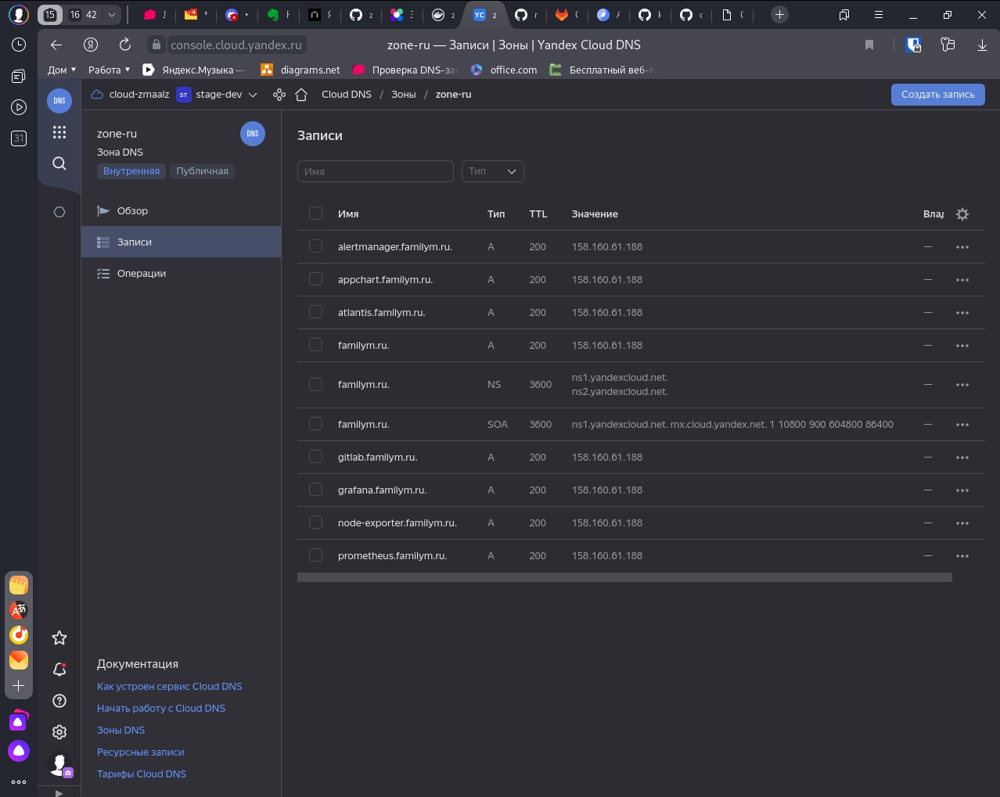|  |

## Kubernetes кластер

### Развертывание кластера

Для развертывания кластера Kubernetes был создан ansible playbook [репозиторий Kube-install.git](https://github.com/zMaAlz/Kube-install) (установка зависимостей и инициация кластера), но при тестирование в Yandex Cloud возникли проблемы со стабильностью работы при использовании стандартных образов centos 7 и fedora 35. После чего было принято решение для развертывания использовать [kubespray](https://github.com/kubernetes-sigs/kubespray) и дстрибутив Ubuntu 20.04 в качестве базового. 

```bash
# Клонируем Kubespray
ansible@gitlab-ru-central1-a:~$ sudo apt -y install python3-pip python3-ruamel.yaml
ansible@gitlab-ru-central1-a:~$ git clone https://github.com/kubernetes-sigs/kubespray.git
ansible@gitlab-ru-central1-a:~/kubespray$ cp -rfp inventory/sample inventory/mycluster
#создаем файл hosts.yaml
ansible@gitlab-ru-central1-a:~/kubespray$ declare -a IPS=(192.168.2.220 192.168.2.221 192.168.2.222 192.168.2.34)
ansible@gitlab-ru-central1-a:~/kubespray$ CONFIG_FILE=inventory/mycluster/hosts.yaml python3 contrib/inventory_builder/inventory.py ${IPS[@]}
ansible@gitlab-ru-central1-a:~/kubespray$ cat inventory/mycluster/hosts.yaml
all:
  hosts:
    node1:
      ansible_host: 192.168.2.220
      ip: 192.168.2.220
      access_ip: 192.168.2.220
    node2:
      ansible_host: 192.168.2.221
      ip: 192.168.2.221
      access_ip: 192.168.2.221
    node3:
      ansible_host: 192.168.2.222
      ip: 192.168.2.222
      access_ip: 192.168.2.222
    node4:
      ansible_host: 192.168.2.17
      ip: 192.168.2.17
      access_ip: 192.168.2.17
  children:
    kube_control_plane:
      hosts:
        node1:
    kube_node:
      hosts:
        node1:
        node2:
        node3:
        node4:
    etcd:
      hosts:
        node1:
    k8s_cluster:
      children:
        kube_control_plane:
        kube_node:
    calico_rr:
      hosts: {}

#запускаем развертывание кластера
ansible-playbook -i inventory/mycluster/hosts.yaml  --become --become-user=root cluster.yml

PLAY RECAP *****************************************************************************************************************************************************************
localhost                  : ok=3    changed=0    unreachable=0    failed=0    skipped=0    rescued=0    ignored=0   
node1                      : ok=755  changed=148  unreachable=0    failed=0    skipped=1267 rescued=0    ignored=8   
node2                      : ok=511  changed=91   unreachable=0    failed=0    skipped=773  rescued=0    ignored=1   
node3                      : ok=511  changed=91   unreachable=0    failed=0    skipped=773  rescued=0    ignored=1   
node4                      : ok=511  changed=91   unreachable=0    failed=0    skipped=773  rescued=0    ignored=1   

Sunday 28 May 2023  11:12:42 +0000 (0:00:00.122)       0:19:38.542 ************ 
=============================================================================== 
download : download_container | Download image if required --------------------------------------------------------------------------------------------------------- 64.40s
download : download_file | Download item --------------------------------------------------------------------------------------------------------------------------- 63.28s
kubernetes/preinstall : Install packages requirements -------------------------------------------------------------------------------------------------------------- 44.00s
kubernetes/kubeadm : Join to cluster ------------------------------------------------------------------------------------------------------------------------------- 38.87s
download : download_container | Download image if required --------------------------------------------------------------------------------------------------------- 37.16s
download : download_file | Download item --------------------------------------------------------------------------------------------------------------------------- 34.95s
download : download_container | Download image if required --------------------------------------------------------------------------------------------------------- 28.10s
download : download_container | Download image if required --------------------------------------------------------------------------------------------------------- 27.67s
container-engine/containerd : download_file | Download item -------------------------------------------------------------------------------------------------------- 26.75s
download : download_container | Download image if required --------------------------------------------------------------------------------------------------------- 26.10s
download : download_file | Download item --------------------------------------------------------------------------------------------------------------------------- 23.87s
download : download_container | Download image if required --------------------------------------------------------------------------------------------------------- 22.67s
download : download_container | Download image if required --------------------------------------------------------------------------------------------------------- 18.13s
download : download_container | Download image if required --------------------------------------------------------------------------------------------------------- 16.74s
download : download_container | Download image if required --------------------------------------------------------------------------------------------------------- 16.70s
container-engine/crictl : download_file | Download item ------------------------------------------------------------------------------------------------------------ 15.31s
download : download_file | Download item --------------------------------------------------------------------------------------------------------------------------- 15.25s
kubernetes/control-plane : kubeadm | Initialize first master ------------------------------------------------------------------------------------------------------- 14.41s
container-engine/runc : download_file | Download item -------------------------------------------------------------------------------------------------------------- 11.19s
container-engine/containerd : containerd | Unpack containerd archive ----------------------------------------------------------------------------------------------- 10.47s
```

Проверяем состояние кластера K8s.

```bash
ansible@gitlab-ru-central1-a:~$ kubectl get node -o wide
NAME    STATUS   ROLES           AGE   VERSION   INTERNAL-IP     EXTERNAL-IP   OS-IMAGE             KERNEL-VERSION      CONTAINER-RUNTIME
node1   Ready    control-plane   38m   v1.26.5   192.168.2.220   <none>        Ubuntu 20.04.6 LTS   5.4.0-148-generic   containerd://1.7.1
node2   Ready    <none>          37m   v1.26.5   192.168.2.221   <none>        Ubuntu 20.04.6 LTS   5.4.0-148-generic   containerd://1.7.1
node3   Ready    <none>          37m   v1.26.5   192.168.2.222   <none>        Ubuntu 20.04.6 LTS   5.4.0-148-generic   containerd://1.7.1
node4   Ready    <none>          37m   v1.26.5   192.168.2.17    <none>        Ubuntu 20.04.6 LTS   5.4.0-148-generic   containerd://1.7.1

ansible@gitlab-ru-central1-a:~$ kubectl get pod --all-namespaces
NAMESPACE     NAME                                      READY   STATUS    RESTARTS   AGE
kube-system   calico-kube-controllers-6dfcdfb99-fzj9t   1/1     Running   0          37m
kube-system   calico-node-8qlcv                         1/1     Running   0          37m
kube-system   calico-node-hhffw                         1/1     Running   0          37m
kube-system   calico-node-k8ghc                         1/1     Running   0          37m
kube-system   calico-node-smnsl                         1/1     Running   0          37m
kube-system   coredns-645b46f4b6-ntccz                  1/1     Running   0          36m
kube-system   coredns-645b46f4b6-v7kcc                  1/1     Running   0          36m
kube-system   dns-autoscaler-659b8c48cb-q6lz5           1/1     Running   0          36m
kube-system   kube-apiserver-node1                      1/1     Running   1          39m
kube-system   kube-controller-manager-node1             1/1     Running   2          39m
kube-system   kube-proxy-8mhk6                          1/1     Running   0          38m
kube-system   kube-proxy-j28km                          1/1     Running   0          38m
kube-system   kube-proxy-v58kx                          1/1     Running   0          38m
kube-system   kube-proxy-x2967                          1/1     Running   0          38m
kube-system   kube-scheduler-node1                      1/1     Running   1          39m
kube-system   nginx-proxy-node2                         1/1     Running   0          37m
kube-system   nginx-proxy-node3                         1/1     Running   0          37m
kube-system   nginx-proxy-node4                         1/1     Running   0          37m
kube-system   nodelocaldns-7wkkf                        1/1     Running   0          36m
kube-system   nodelocaldns-bzfd8                        1/1     Running   0          36m
kube-system   nodelocaldns-j2pbs                        1/1     Running   0          36m
kube-system   nodelocaldns-k2cnt                        1/1     Running   0          36m

```

### Деплой приложений в кластер

В кластере K8s развернуты следующие информационные системы и компоненты kubernetes:
- CNI - Calico
- CSI - ceph-csi-rbd
- ingress-nginx для Kubernetes
- reg-forms-app (тестовое приложение)
- prometheus

[kube-config.git](https://github.com/zMaAlz/kube-config) - репозиторий с манифестами и скриптами для установки систем в кластер Kubernetes

#### CNI - Calico

Устанавливается в процессе развертывания кластера K8s.

#### CSI - ceph-csi-rbd

На ВМ ceph_instance устанавливаем [docker](https://github.com/zMaAlz/Docker-install.git) для устанвоки кластера Ceph. Также сразу установим докер на gitlab_instance, в дальнейгем будем его использовать для запуска Gitlab.

```bash
gansible@gitlab-ru-central1-a:~$ it clone https://github.com/zMaAlz/Docker-install.git && cd Docker-install
ansible@gitlab-ru-central1-a:~/Docker-install$ ansible-playbook -i inventory/hosts.yml install_docker.yml --diff -v  
PLAY [Server preparation] ********************************************************************************************************************************************************************************************************************

TASK [Gathering Facts] ***********************************************************************************************************************************************************************************************************************
ok: [srv1]
ok: [srv2]
...
PLAY RECAP ***********************************************************************************************************************************************************************************************************************************
srv1                       : ok=11   changed=6    unreachable=0    failed=0    skipped=7    rescued=0    ignored=0   
srv2                       : ok=11   changed=6    unreachable=0    failed=0    skipped=7    rescued=0    ignored=0   

```

В качестве CSI для kubernetes используется [ceph-csi-rbd](https://artifacthub.io/packages/helm/ceph-csi/ceph-csi-rbd), для установки кластера используется playbook [Ceph кластер в режиме single-host](https://github.com/zMaAlz/ceph_single_host).

```bash
ansible@gitlab-ru-central1-a:~$ git clone https://github.com/zMaAlz/ceph_single_host.git && cd ceph_single_host 
ansible@gitlab-ru-central1-a:~/ceph_single_host$ ansible-playbook -i inventory/hosts.yml install_single-host.yml --diff -v

PLAY [Ceph cluster to run on a single host] *************************************************************************************************************************************************************

TASK [Gathering Facts] **********************************************************************************************************************************************************************************
ok: [cephmonitor]

...

TASK [Print ceph fsid] ***********************************************************************************************************************************************
ok: [cephmonitor] => {
    "ceph_cluster_id.stdout": "f0dea612-....-d00d30ef8b2c"
}

TASK [Print ceph IP] *************************************************************************************************************************************************
ok: [cephmonitor] => {
    "ceph_cluster_ip.stdout": "epoch 1\nfsid f0dea612-fd4e-11ed-a13d-d00d30ef8b2c\nlast_changed 2023-05-28T11:58:58.729086+0000\ncreated 2023-05-28T11:58:58.729086+0000\nmin_mon_release 17 (quincy)\nelection_strategy: 1\n0: [v2:192.168.2.200:3300/0,v1:192.168.2.200:6789/0] mon.ceph-ru-central1-a"
}

TASK [Print key rbdkube] *********************************************************************************************************************************************
ok: [cephmonitor] => {
    "ceph_userkey_id.stdout": "AQBz...DdbA=="
}

PLAY RECAP ***********************************************************************************************************************************************************
cephmonitor                : ok=15   changed=6    unreachable=0    failed=0    skipped=1    rescued=0    ignored=0   

```

Последнии задания в плейбуке выводят на экран информацию о параметрах кластера Ceph, сохраняем ее, в дальнейшем она понадобиться для настройки CSI. 

```bash
ansible@gitlab-ru-central1-a:~/kube-config/csi$ ls
add-repo.sh  cephrbd.yml  install.sh  namespace.yaml  secret.yaml  storageclass.yaml

# В файлы cephrbd,secret.yaml, storageclass.yaml добавляем информацию о кластере Ceph и запускаем скрипты add-repo.sh и install.sh

```

#### ingress-nginx для Kubernetes

Балансировщик нагрузки в я.облаке уже создан и отслеживает состояние нод с лейблом ingress, но для управляемого доступа к ресурсам кластера k8s потребуется ingress контроллер. 

```bash
# Убираем с ingress ноды все кроме daemonsets и добавляем на ноду лейбл role=ingress
ansible@gitlab-ru-central1-a:~/kube-config/ingress-nginx$ kubectl drain node4 --ignore-daemonsets --delete-emptydir-data
node/node4 cordoned
Warning: ignoring DaemonSet-managed Pods: ceph-csi-rbd/ceph-csi-rbd-nodeplugin-9wmql, kube-system/calico-node-hhffw, kube-system/kube-proxy-8mhk6, kube-system/nodelocaldns-bzfd8
evicting pod ceph-csi-rbd/ceph-csi-rbd-provisioner-545fd8df86-r4k2p
pod/ceph-csi-rbd-provisioner-545fd8df86-r4k2p evicted
node/node4 drained

ansible@gitlab-ru-central1-a:~/kube-config/ingress-nginx$ kubectl label nodes node4 "[role=ingress]"
node/node4 labeled

ansible@gitlab-ru-central1-a:~/kube-config/ingress-nginx$ ls
add-repo.sh  drain_ingress_nodes.sh  helm-nginx-ingress.sh  namespace.yaml  values.yaml
# Запускаем скрипты add-repo.sh и install.sh для установки контроллера ingress-nginx

nsible@gitlab-ru-central1-a:~/kube-config/testpod$ kubectl get svc
NAME                                      TYPE           CLUSTER-IP      EXTERNAL-IP   PORT(S)                      AGE
alertmanager-operated                     ClusterIP      None            <none>        9093/TCP,9094/TCP,9094/UDP   4h1m
gitlab-svc                                ClusterIP      10.233.50.80    <none>        8929/TCP                     3h42m
ingress-nginx-controller                  LoadBalancer   10.233.12.199   <pending>     80:30436/TCP,443:31624/TCP   4h7m
ingress-nginx-controller-admission        ClusterIP      10.233.53.66    <none>        443/TCP                      4h7m
kubernetes                                ClusterIP      10.233.0.1      <none>        443/TCP                      5h28m
monitoring-grafana                        ClusterIP      10.233.13.67    <none>        80/TCP                       4h1m
monitoring-kube-prometheus-alertmanager   ClusterIP      10.233.29.129   <none>        9093/TCP                     4h1m
monitoring-kube-prometheus-operator       ClusterIP      10.233.33.52    <none>        443/TCP                      4h1m
monitoring-kube-prometheus-prometheus     ClusterIP      10.233.19.35    <none>        9090/TCP                     4h1m
monitoring-kube-state-metrics             ClusterIP      10.233.31.208   <none>        8080/TCP                     4h1m
monitoring-prometheus-node-exporter       ClusterIP      10.233.17.23    <none>        9100/TCP                     4h1m
prometheus-operated                       ClusterIP      None            <none>        9090/TCP                     4h1m

ansible@gitlab-ru-central1-a:~/kube-config/testpod$ kubectl get ingress
NAME         CLASS   HOSTS                                                                          ADDRESS   PORTS   AGE
atlantis     nginx   atlantis.familym.ru                                                                      80      3h57m
monitoring   nginx   grafana.familym.ru,prometheus.familym.ru,alertmanager.familym.ru + 1 more...             80      4h6m

```

####  Мониторинг состояния кластера (Стек Prometheus)

Для корректного перенаправления трафика балансировщиком создем правила ingress. И устанавливаем helm chart Kube-Prometheus-Stack.


```bash
ansible@gitlab-ru-central1-a:~/kube-config/prometheus$ ls
helm-prometheus.sh  ingress.yaml
ansible@gitlab-ru-central1-a:~/kube-config/prometheus$ kubectl apply -f ingress.yaml 
ingress.networking.k8s.io/monitoring created
ansible@gitlab-ru-central1-a:~/kube-config/prometheus$ ./helm-prometheus.sh 
"prometheus-community" has been added to your repositories
Hang tight while we grab the latest from your chart repositories...
...
kube-prometheus-stack has been installed. Check its status by running:
  kubectl --namespace default get pods -l "release=monitoring"

```
После чего мы можем получить доступ к мониторингу по доменному имени.

http://prometheus.familym.ru:8081/

http://grafana.familym.ru:8081/

http://node-exporter.familym.ru:8081/


|:----------------------:|:-----------------------:|:----------------------------:|:----------------------------:|
|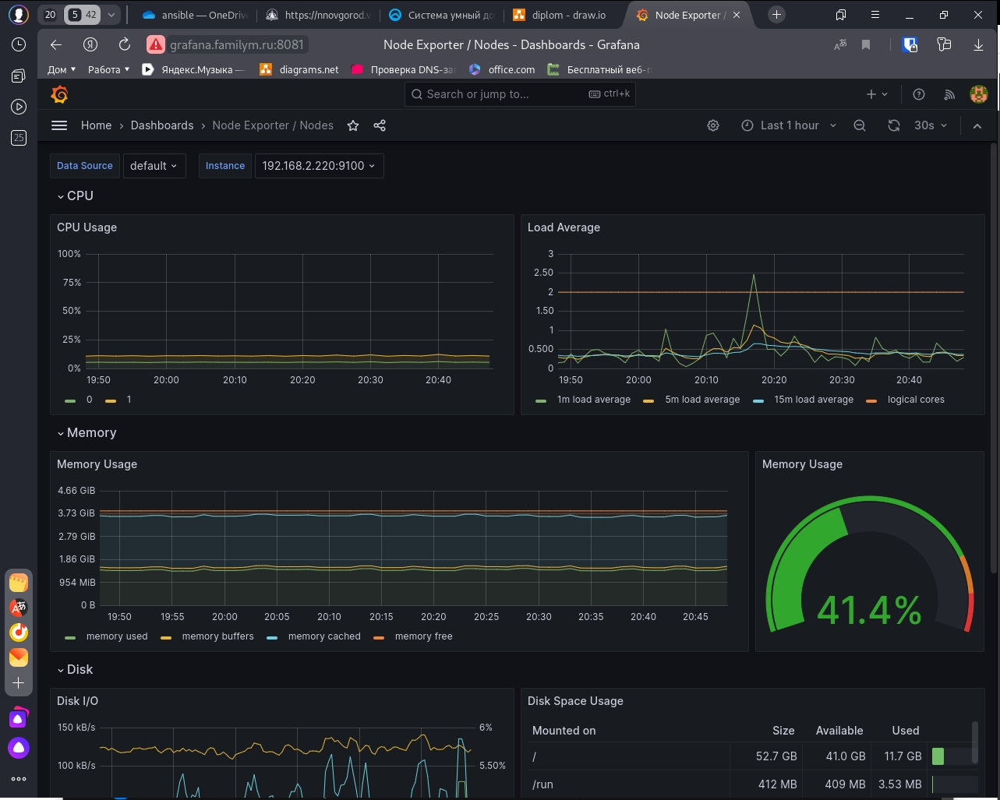 | 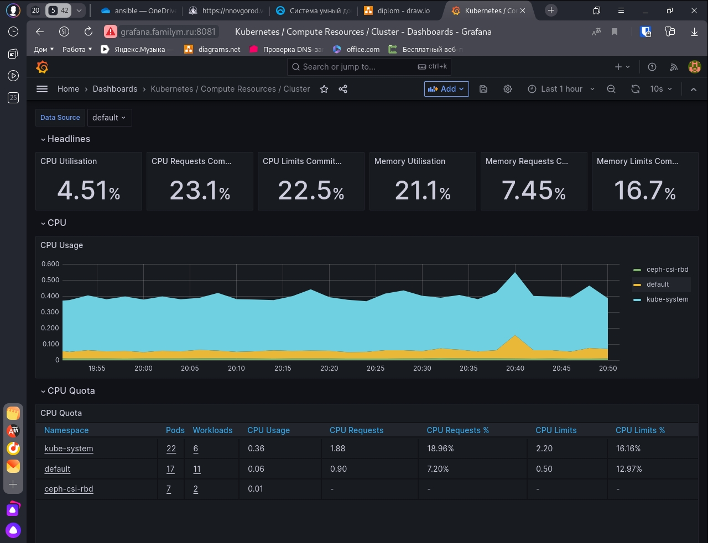 | 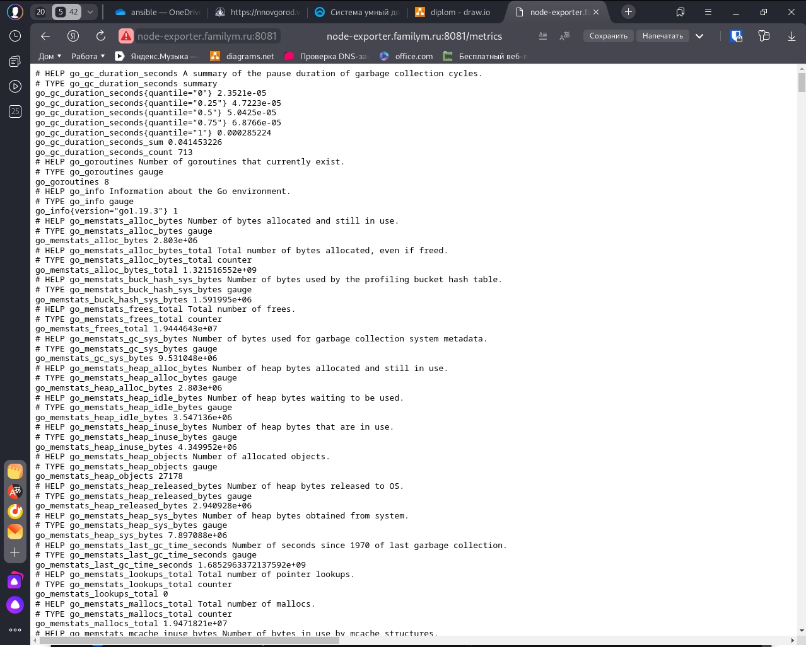 | 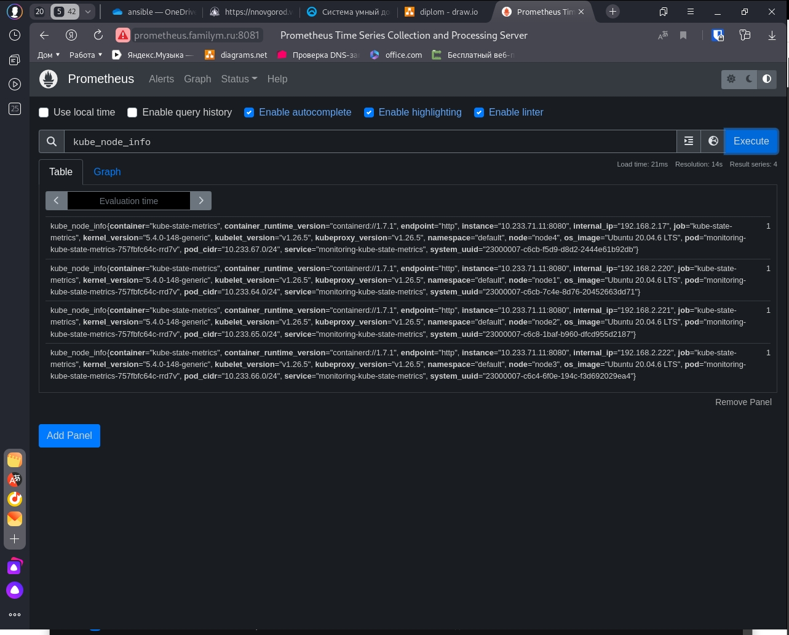  |


#### Деплой тестового приложения

Тестовое приложение доступно по доменному имени  http://appchart.familym.ru:8081/

[reg-forms-app.git](https://github.com/zMaAlz/reg-forms-app) - репозиторий с исходниками тестового приложения reg-forms-app и helm chart для развертывания в Kubernetes.

[zmaalz/reg-forms-app](https://hub.docker.com/repository/docker/zmaalz/reg-forms-app/general) - Docker образ в репозитории Docker Hub

```bash
ansible@gitlab-ru-central1-a:~/ git clone  https://github.com/zMaAlz/reg-forms-app.git && cd reg-forms-app
ansible@gitlab-ru-central1-a:~/ helm install appchart ./appchart 

```

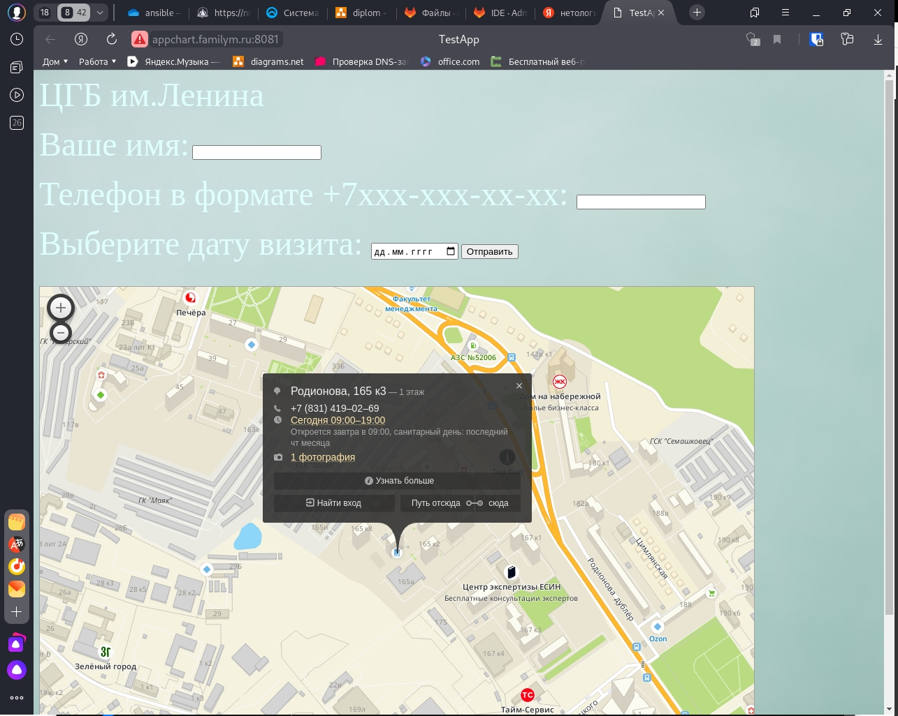
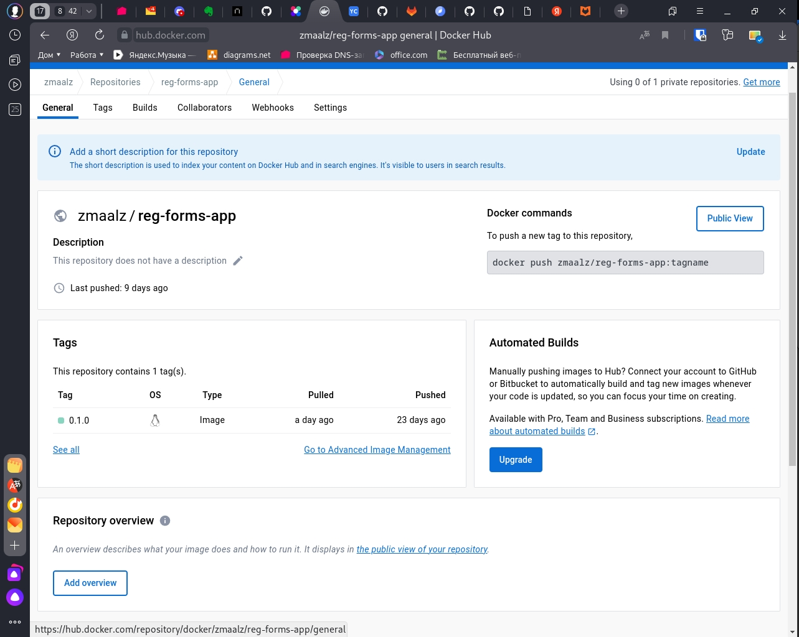


## CI/CD


[Устанавливаем](https://github.com/zMaAlz/scripts/tree/main/Ansible/admin-PC) дополнительные компоненты (helm,kubectl) и создаем каталоги на gitlab_instance и ceph_instance для Gitlab Runner


```bash
ansible@gitlab-ru-central1-a:~$ git clone  https://github.com/zMaAlz/scripts.git && cd scripts/Ansible/admin-PC
ansible@gitlab-ru-central1-a:~/scripts/Ansible/admin-PC$ ansible-playbook -i inventory/hosts.yaml install.yml --diff -v
No config file found; using defaults

PLAY [Preparation CICD server] **************************************************************************************************************************************************************************

TASK [Gathering Facts] **********************************************************************************************************************************************************************************
ok: [lb]
ok: [cicd]

PLAY RECAP **********************************************************************************************************************************************************************************************
cicd                       : ok=9    changed=6    unreachable=0    failed=0    skipped=1    rescued=0    ignored=0   
lb                         : ok=9    changed=5    unreachable=0    failed=0    skipped=1    rescued=0    ignored=0   
```

``` bash
# В K8s добавляем EndpointSlice и Service для перенаправления трафика в Gitlab
ansible@gitlab-ru-central1-a:~/kube-config/gitlab$ ls
helm-gitlab.sh  service_ep.yaml  values.yaml
ansible@gitlab-ru-central1-a:~/kube-config/gitlab$ kubectl apply -f service_ep.yaml 
service/gitlab-svc created
endpointslice.discovery.k8s.io/gitlab-ep created

```

Gitlab разворачиваем на gitlab_instance при помощи манифеста [docker-compose](https://github.com/zMaAlz/scripts/tree/main/Docker/gitlab). В балансировщике нагрузке уже добавлено правило для GitLab, пожтому Web интерфейс доступен по адресу http://gitlab.familym.ru:8082. 

GitLab CI работает с GitHub только с версии premium, поэтому для корректной работы необходимо мигрировать репозиторий в GitLab. Выбираем проект reg-forms-app и в CI/CD Settings копируем токен для подключения Gitlab Runner и создаем переменные с данными авторизации в docker registry

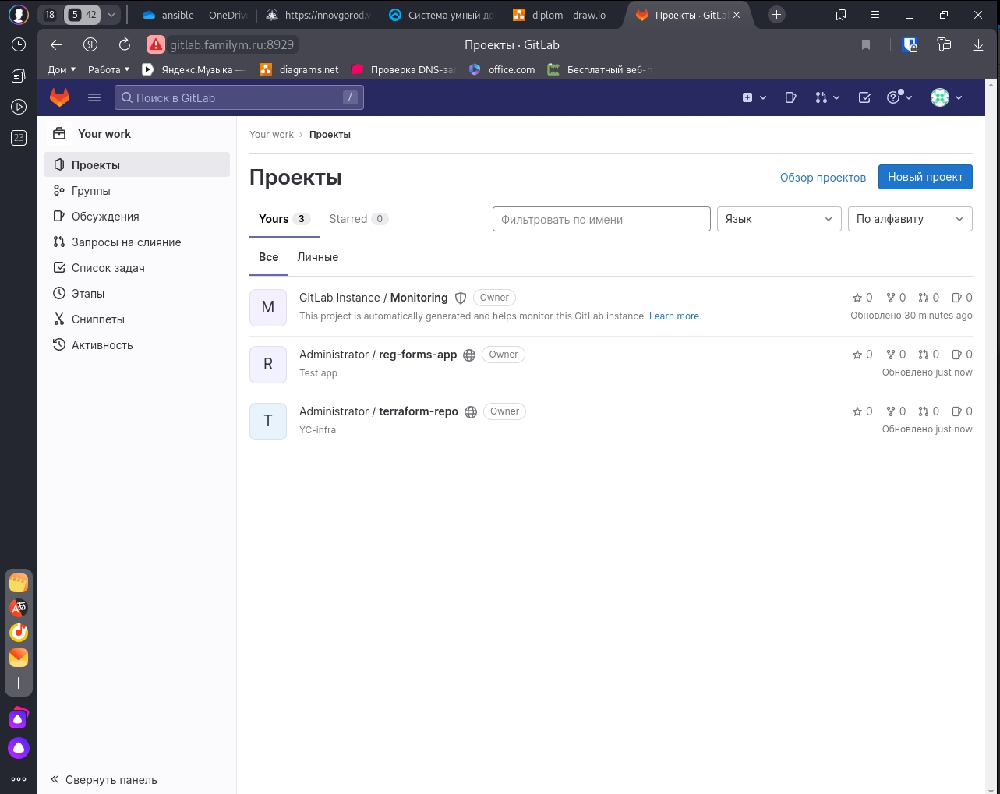
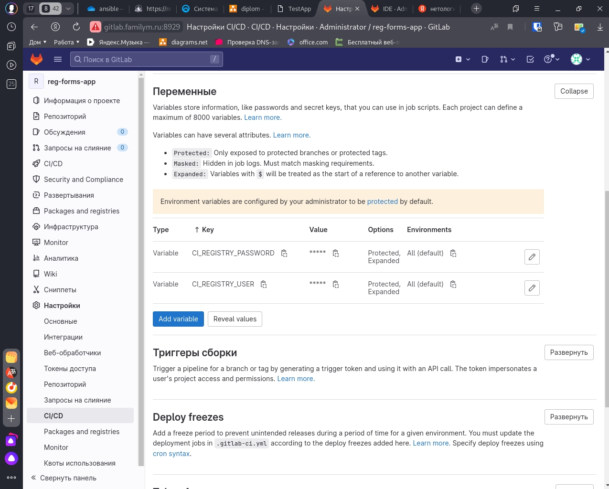


Gitlab Runner установлен на виртуальной машине ceph_instance при помощи [ansible-playbook](https://github.com/zMaAlz/scripts/tree/main/Ansible/gitlab_runner). Перед установкой добавляем токен в groupe_vars.

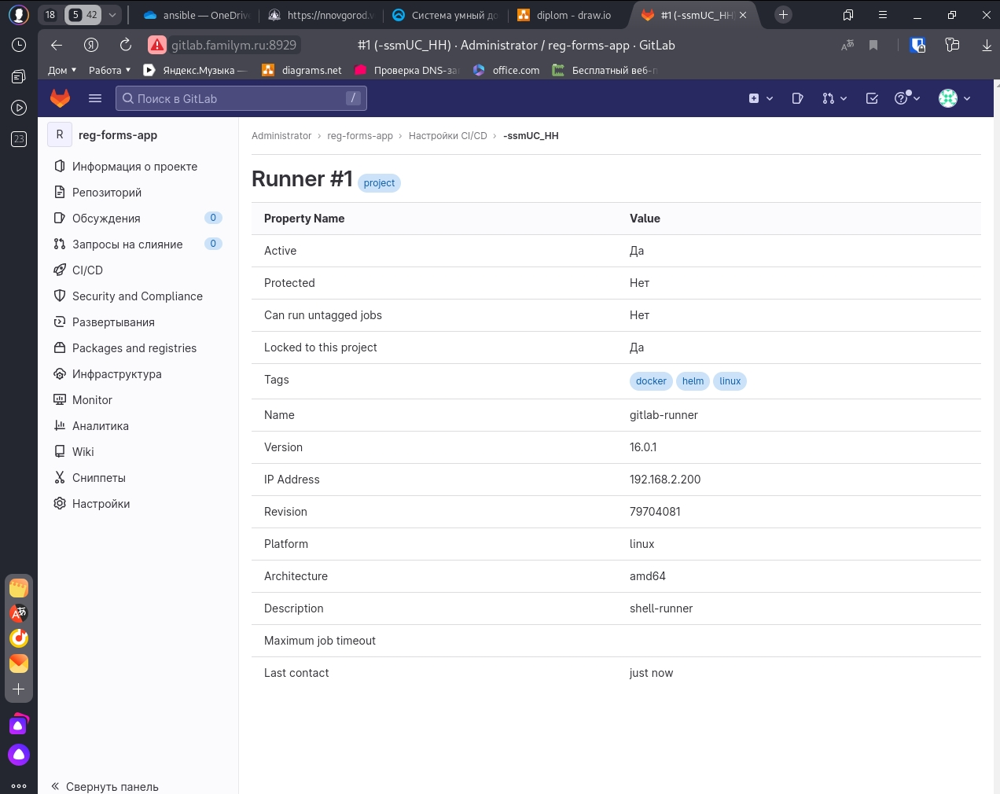


При любом коммите в репозиторие с тестовым приложением происходит сборка и отправка в регистр Docker образа.
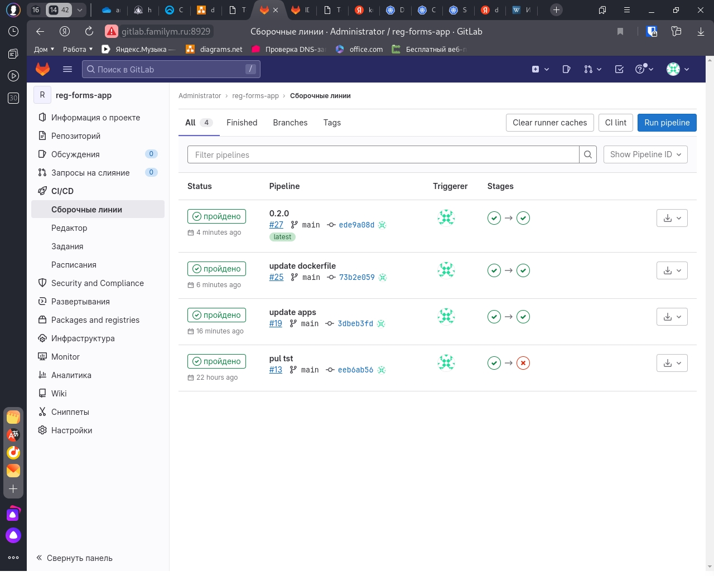
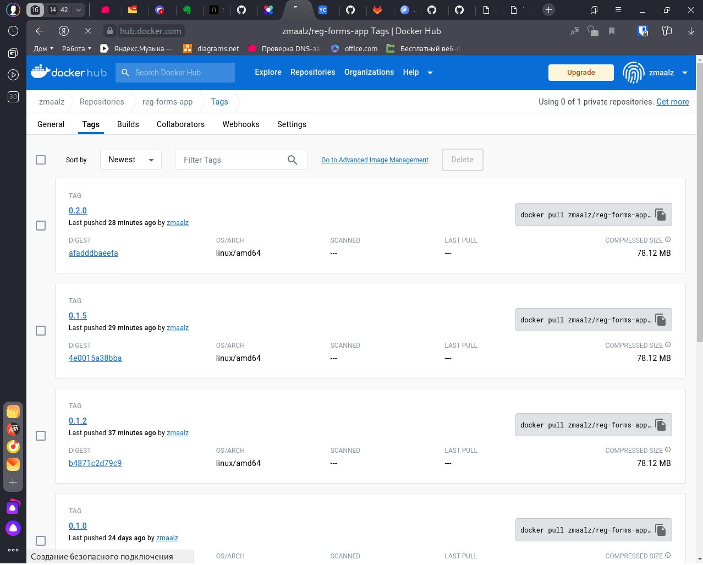

